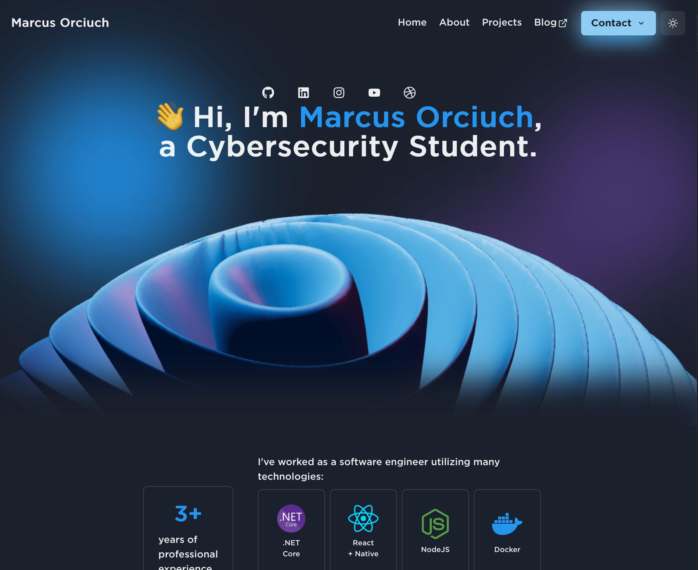

# m.orciuch.org - Personal portfolio



This website is a week long project that started after I became disappointed with my old site. 
## Stack

I used [Next.js](https://nextjs.org/) to be able to host for free on [Vercel](https://vercel.com) with no extra hassle. Used ChakraUI and Three.JS (using @react-three/fiber).

## Development

To run this app, install the project dependencies:
```bash
yarn
```

Then, run the site in development mode:
```bash
yarn dev
```

Recommended `.vscode/launch.json`:
```json
{
    "version": "0.2.0",
    "configurations": [
        {
            "type": "pwa-node",
            "request": "launch",
            "name": "Next: Node",
            "runtimeExecutable": "${workspaceFolder}/node_modules/.bin/next"
        }
    ]
}
```

Recommended `.vscode/settings.json`:
```json
{
    "editor.codeActionsOnSave": { "source.fixAll.eslint": true }, 
    "editor.formatOnSave": true, 
    "eslint.alwaysShowStatus": true, 
    "files.autoSave": "onFocusChange",
    "eslint.run": "onSave"
}
```